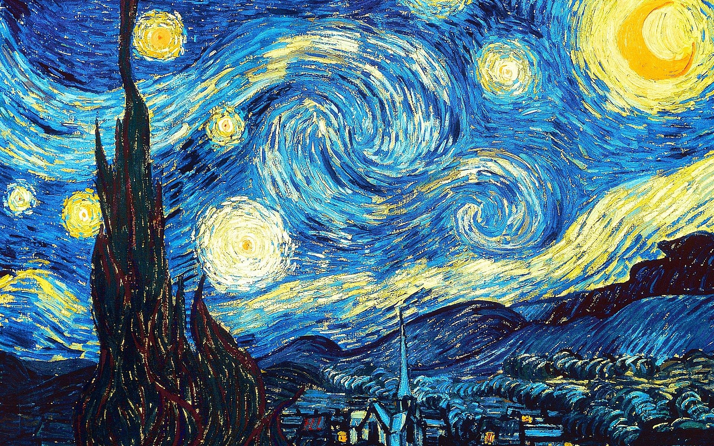
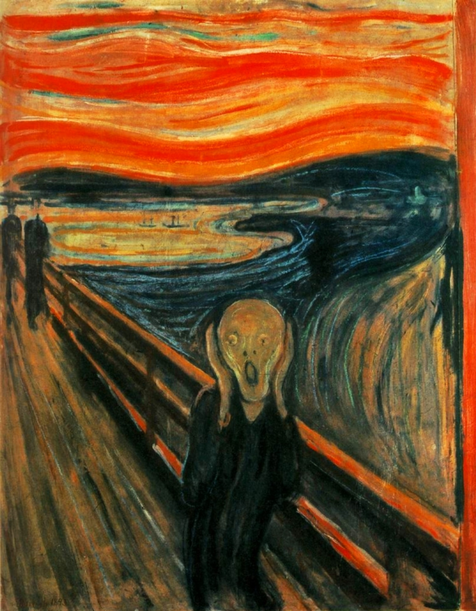
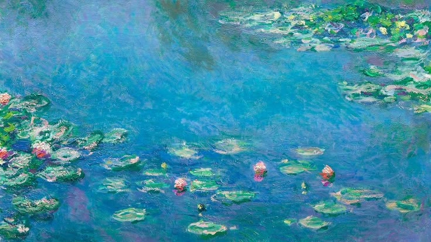

# 🖼️ Neural Style Transfer with PyTorch

This project implements a Neural Style Transfer algorithm using `PyTorch`. It blends the content of one image with the style of another, generating a unique, stylized result.

## Table of Contents

1. [Features](#features)
2. [Setup and Installation](#setup-and-installation)
3. [Inference](#inference)
4. [Results](#results)

## Features

- Built using `PyTorch` and `Torchvision`
- Uses a pretrained `VGG19` for feature extraction
- Gram matrix loss for style transfer
- Command-line interface for customizing input and training

## Setup And Installation

1. **Clone the Repository:**

    ```bash
    git clone https://github.com/matin-ghorbani/Neural-Style-Transfer
    cd Neural-Style-Transfer
    ```

2. **Install the Required Packages:**
    Ensure you have Python 3.9+ and PyTorch installed. Install the dependencies using pip:

    ```bash
    pip install -r requirements.txt
    ```

## Inference

Run this command:

```bash
python3 main.py --org-img images/matin.png \
    --style-img images/starry_night_style.jpg
```

You can also see the other arguments of it with this command

```bash
clear; python main.py --help
```

*For Example:*

- *`--steps`*: Total steps to modify the original image. **default:***`6000`*
- *`--save-samples, --no-save-samples`*: Save sample images or not. **default:***`True`*

## Results

| **Starry Night** | **Edvard Munch** | **Water Lilies** |
|:----------------:|:----------------:|:----------------:|
|  |  |  |

| **Output** | **Output** | **Output** |
|:----------------:|:----------------:|:----------------:|
|  |  |  |

The main image was:
---

